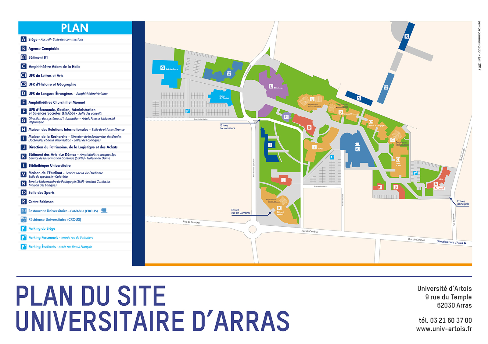

<!-- $theme: gaia -->
<!-- $width: 1600 -->
<!-- $size: a4 -landscape -->


# MARP Guide de syntaxe avancé
## Interactions et directives

_version 1.1_

Guide de syntaxe pour la mise en forme [MARP](https://yhatt.github.io/marp/).

---

- Lien vers une URL ou une ressource
- Insertion d'une image
- Papier-peint de diapositive
- Image cliquable
- Les directives 
	-  	Thème
	-  	Video inversion
	-  	Dimensions des diapositives
	-  	Pied de page
	-  	Numérotation des diapositives

---

## Lien vers un site ou une ressource

:white_check_mark: Copier et coller le lien directement dans l'éditeur:

https://www.qwant.com/images

:white_check_mark: Lien sur un mot, exemple :

Rendez-vous sur [Qwant Images](https://www.qwant.com/images) pour effectuer la recherche.

---

## Syntaxe en deux éléments
- entre crochets le texte du lien 
- entre parenthèses l'adresse Web

```
Rendez-vous sur [Qwant Images](https://www.qwant.com/images)
pour effectuer la recherche.
```

---

## Insérer une image

Stocker l'image dans le même dossier que le fichier Marp ou dans un sous-dossier :



---

## Syntaxe d'insertion d'une image

```

```

 :pushpin:On ajoute un **!** devant
 :pushpin:**Deux crochets** obligatoires avec les paramètres optionnels : 
 :key: **taille** de l'image en % donc adaptable à l'écran
 :key:**center** ou rien pour à gauche
 :pushpin:**Chemin vers l'image entre parenthèses**

---

# Papier peint


---

### Instruction pour un papier peint : 


```

```

bg pour **B**ack**G**round

Paramètres optionnels : 
:arrow_right: 50% de la taille originale du fichier
:arrow_right: original pas d'adaptation à l'écran

```


```

---

## Image cliquable

S'effectue grâce à une imbriquation de l'instruction lien autour de cellle de l'image :

[](http://www.univ-artois.fr/)

---

## Syntaxe d'un lien sur une image :

L'image est "déclarée" entre les crochets du lien :
```
[]
(http://www.univ-artois.fr/)
```

---

## Les directives

**Directives globales** : agissent sur la présentation complète

**Directive locales** : agissent sur la diapositive 

---

# Le thème

Menu View/Thème ou insérer la directive

```
<!-- $theme: default -->
ou
<!-- $theme: gaia -->
```
Le thème est actif dans toute la présentation.

---

<!-- template: invert -->

# Inversion du thème

Cette directive permet d'afficher la diapositive et les suivantes en vidéo inverse : 


```
<!-- template: invert -->
```

---

## Retour au thème par défaut

```
<!-- template: normal -->
```

<!-- template: normal -->

---

## Dimensions des diapositives

**Selon le ratio de l'écran :** 16/9 ou 4/3
**Ou une taille d'impression** : A3, A4 ou A5 avec orientation possible en portrait

```
<!-- $size: a4 -portrait -->

<!-- $size: a4 -landscape -->

```

Pour un video projecteur, préférer 4/3

---

## Dimensions des diapositives

Exprimées par défaut  en pixel ou en `cm`, `mm`, `in`, `pt`, et `pc`.

```
<!-- $width: 1024 -->
<!-- $height: 768 -->
```
Soit 1024 pixels x 768.

---

## Selon la taille de l'écran (4/3, non panoramique) :

|Diagonale|Définition|
|-|-|
|15"|800x600|
|17"|1024x768|
|19"|1280x1024|
|21"|1600x1200|

[Source](http://www.commentcamarche.net/contents/744-le-moniteur-ou-ecran-d-ordinateur)

---

## Pied de page

Cette directive ajoute un pied de page à partir de la diapositive courante:

```
<!-- footer: Marp Guide avancé -->
```

<!-- footer: Marp Guide avancé -->


---

## Numérotation des pages

La numérotation des pages commencent à partir de la page qui contient cette directive :
```
<!-- page_number: true -->
```

Il est donc logique de l'insérer à la première ou la seconde page du diaporama.

<!-- page_number: true -->

---

## Cette page est numérotée

---

#### Pour `désactiver` l'affichage de la numérotation : 

```
<!-- page_number: false -->
```
<!-- page_number: false -->


